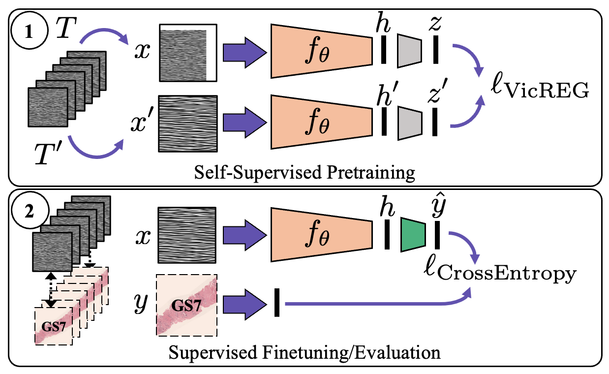

Self-Supervised Learning with Limited Labeled Data for Prostate Cancer Detection in High Frequency Ultrasound
============================================


<p align="center">
  
   
</p>


code for the paper [Self-Supervised Learning with Limited Labeled Data for Prostate Cancer Detection in High Frequency Ultrasound](https://arxiv.org/abs/2211.00527)

## Abstract

Deep learning-based analysis of high-frequency, high-resolution micro-ultrasound data shows great promise for prostate cancer detection. Previous approaches to analysis of ultrasound data largely follow a supervised learning paradigm. Ground truth labels for ultrasound images used for training deep networks often include coarse annotations generated from the histopathological analysis of tissue samples obtained via biopsy. This creates inherent limitations on the availability and quality of labeled data, posing major challenges to the success of supervised learning methods. On the other hand, unlabeled prostate ultrasound data are more abundant. In this work, we successfully apply self-supervised representation learning to micro-ultrasound data. Using ultrasound data from 1028 biopsy cores of 391 subjects obtained in two clinical centres, we demonstrate that feature representations learnt with this method can be used to classify cancer from non-cancer tissue, obtaining an AUROC score of 91% on an independent test set. To the best of our knowledge, this is the first successful end-to-end self-supervised learning approach for prostate cancer detection using ultrasound data. Our method outperforms baseline supervised learning approaches, generalizes well between different data centers, and scale well in performance as more unlabeled data are added, making it a promising approach for future research using large volumes of unlabeled data.

The basic codebase is implemented in Python 3.8.13 and is provided in experiments folder. The package version used for development are as follows:


Install all requirements using following commands
```bash
pip install -r requirements.txt
```
## Note
The code uses **PyTorch Lightning** to remove code boiler plates. **Hydra** is used for configuration management, and **wandb** for logging. This code is tested on a single GPU.

## Usage

The easiest way to read the code is as follows:
`train.py` is the main python file to run the code. It uses hydra to load the main configuration file which is `configs/train.yaml`. This file contains configurations of datamodule, model, callbacks, trainer, and logger as separate groups of configurations stored in `config/{ConfigGroup}`. Having the configurations of all these groups, the corresponding classes are instantiated in `training_pipeline.py` based on the location of their code stored in `_target_` in each group of configuration. Finally, different experiments can be run by overriding these group of configs `python train.py datamodule=data.yaml model=model.yaml callbacks=callback.yaml etc.` or simply passing all these arguments all at once stored for different experiments in `configs/experiments` by **`python train.py experiment=experiment_name`**. This automatically overrides all the config groups.

### Data

The data used in this work is **private**. If you have access to data please add your username and passwork in `.env` file.

```bash
SERVER_USERNAME=yourusername
SERVER_PASSWORD=yourpassword
```
The data will be downloaded to your local machine. To specify the location of the data, please add the following line to the `.env` file:
    
```bash
DATA = /path/to/data
```
### Training 
To run supervised training
```bash
python train.py experiment=exact_supervised.yaml
```

To pretrain the model (with VICReg), run the following command:

```bash
python train.py experiment=exact_vicreg.yaml
```

To finetune the model, run the following command:

```bash
python train.py experiment=exact_finetune.yaml
```

### 

## Citation

If you find this code useful, please consider citing our paper:

> Paul Wilson*, Mahdi Gilany*, Amoon Jamzad, Fahimeh Fooladgar, Minh To, Brian Wodlinger, Purang Abolmaesumi, Parvin Mousavi. (2022s). Self-Supervised Learning with Limited Labeled Data for Prostate Cancer Detection in High Frequency Ultrasound. arXiv preprint arXiv:2211.00527. 

\* indicates equal contribution

```bibtex
@article{wilson2022self,
  title={Self-Supervised Learning with Limited Labeled Data for Prostate Cancer Detection in High Frequency Ultrasound},
  author={Wilson*, Paul FR and Gilany*, Mahdi and Jamzad, Amoon and Fooladgar, Fahimeh and To, Minh Nguyen Nhat and Wodlinger, Brian and Abolmaesumi, Purang and Mousavi, Parvin},
  journal={arXiv preprint arXiv:2211.00527},
  year={2022}
}
```